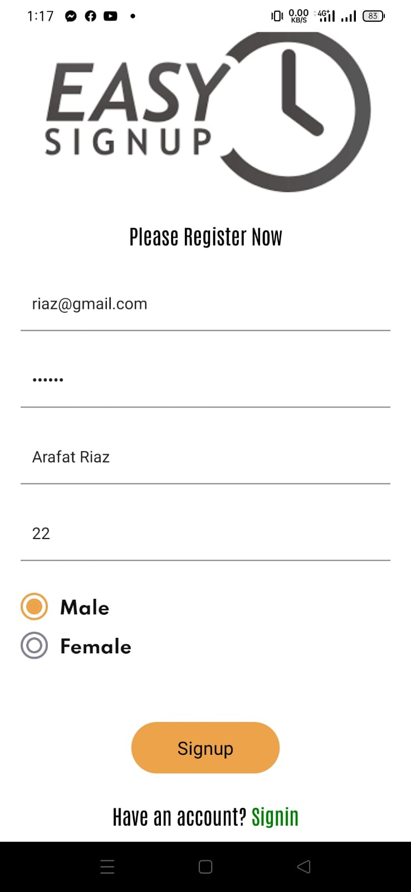
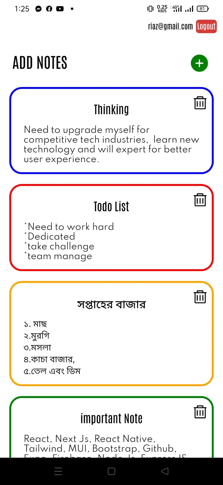
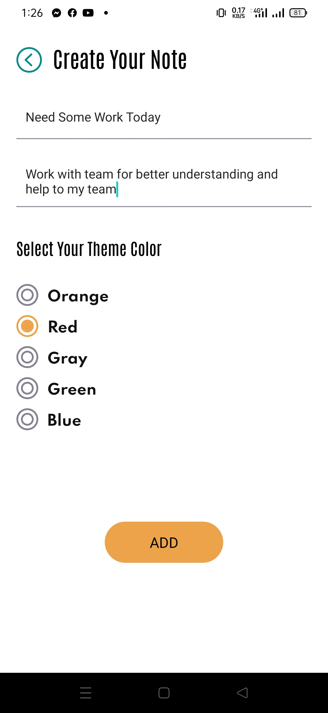
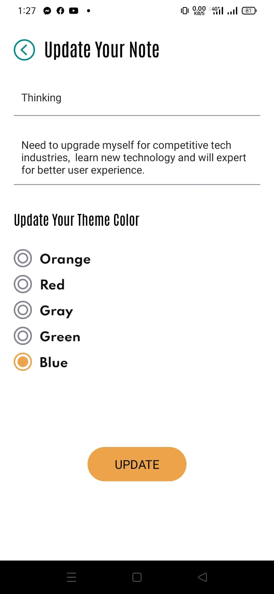
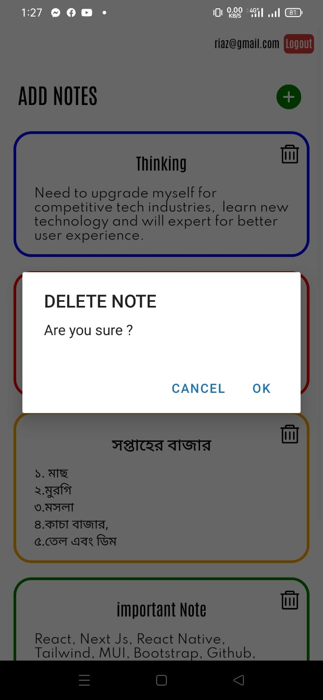

Login screen

  
 

Registration screen

  
 

Home screen and all notes read from here

  
 

Create screen, create new note from here

  
 

Update screen, Update existing notes from here

  
 

Update Modal, Delete notes from here

  
 

